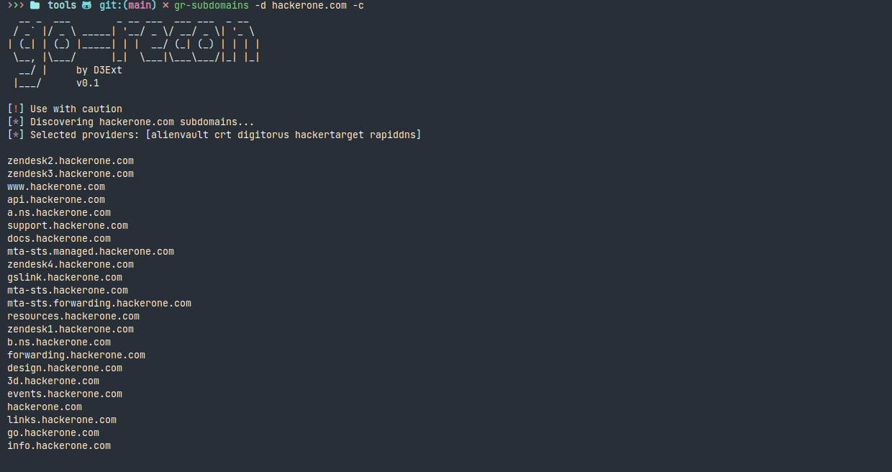
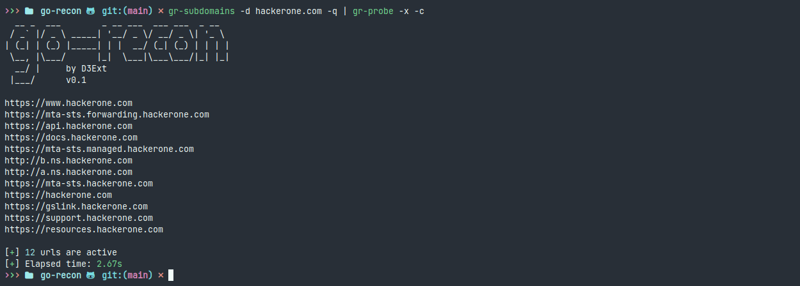

<p align="center">
  
  <h1 align="center">go-recon</h1>
  <h4 align="center">Bug Bounty and external recon toolkit</h4>
  <h6 align="center">Hecho con 💙 por D3Ext</h6>

</p>

<p align="center">

  <a href="https://opensource.org/licenses/MIT">
    
  </a>

  <a href="https://github.com/D3Ext/go-recon/issues">
    
  </a>

  <a href="https://goreportcard.com/report/github.com/D3Ext/go-recon">
    
  </a>

</p>

<p align="center">
  <a href="#introducción">Introducción</a> •
  <a href="#herramientas">Herramientas</a> •
  <a href="#instalación">Instalación</a> •
  <a href="#uso">Uso</a> •
  <a href="#contribuir">Contribuir</a> •
</p>

# Introducción


# Herramientas

- ***gr-subdomains*** Encuentra todos los subdominios de un dominio (pasivo)
- ***gr-urls*** Encuentra muchas URLs de un dominio de diferentes fuentes
- ***gr-probe*** Prueba subdominios activos (http y https)
- ***gr-js*** Extrae endpoints de Javascript de URLs
- ***gr-403*** Intenta evadir paginas que devuelven codigo de estado 403 (forbidden)
- ***gr-openredirects*** Fuzzea por posibles open redirects en las URLs dadas
- ***gr-dns*** Consigue información DNS de dominios
- ***gr-aws*** Encuentra buckets S3 para un dominio/s
- ***gr-waf*** Identifica si es posible el WAF esta corriendo en una URL
- ***gr-tech*** Identifica las tecnologías corriendo en una URL (similar a wappalyzer)
- ***gr-filter*** Elimina las URLs duplicadas, las inutiles (imagenes, css...) y mas, a partir de una lista de endpoints
- ***gr-replace*** Reemplaza palabras clave o el valor de un parametro por el valor proporcionado, en una lista de urls
- ***gr-secrets*** Busca API keys y secretos en paginas html y js
- ***gr-crawl*** Realiza crawling velozmente en URLs, con profundidad personalizada y mas opciones
- ***gr-whois*** Realiza consultas WHOIS a dominios

# Funciones

- Rapidez y concurrencia
- Configurable mediante argumentos CLI
- Facil de usar
- Las herramientas se pueden combinar entre ellas
- Soporta STDIN y STDOUT
- Acceso directo a la API del paquete
- Probado en Linux

# Instalación

Compila e instala el codigo fuente mediante Github:

```sh
git clone https://github.com/D3Ext/go-recon
cd go-recon
make
sudo make install
```

Instala el paquete de Golang oficial ***go-recon*** de esta forma:

```sh
go get github.com/D3Ext/go-recon/pkg/go-recon
```

# Uso

Todas las herramientas se usan de forma similar y con los mismos parametros CLI

> Ejemplo de panel de ayuda
```
Usage of gr-secrets:
    -u)       url to search for secrets in (i.e. https://example.com/script.js)
    -l)       file containing a list of JS endpoints to search for secrets (one url per line)
    -r)       custom regex to search for (i.e. apikey=secret[a-z]+)
    -lr)      file containing a list of custom regex to search for (one regex per line)
    -w)       number of concurrent workers (default=15)
    -o)       output file to write secrets into
    -a)       user agent to include on requests (default=none)
    -c)       print colors on output
    -t)       milliseconds to wait before each request timeout (default=5000)
    -q)       don't print banner, only output
    -h)       print help panel

Examples:
    gr-secrets -u https://example.com -o secrets.txt -c
    gr-secrets -l js.txt -w 10 -t 6000
    gr-secrets -u https://example.com -lr regex.txt
    cat js.txt | gr-secrets -r "secret=api_[A-Z]+"
```

Mira [aqui](https://github.com/D3Ext/go-recon/blob/main/USAGE.md) para ejemplos real de reconocimiento externo

# Demo







# API

Si quieres usar ***go-recon*** en tu propio codigo en Golang mira [aquí](https://github.com/D3Ext/go-recon/tree/main/examples)

# TODO

- Mas herramientas y funciones
- Dockerfile
- Reportes de resultados en formato HTML
- Mas optimización
- Comparar resultados con otras herramientas como **subfinder**, **gau**, **httprobe**...

# Referencias

Inspirado y motivado por herramientas increibles como estas:

```
https://github.com/lc/gau
https://github.com/lc/subjs
https://github.com/tomnomnom/httprobe
https://github.com/projectdiscovery/subfinder
https://github.com/tomnomnom/waybackurls
https://github.com/projectdiscovery/nuclei
https://github.com/tomnomnom/qsreplace
https://github.com/hakluke/hakrawler
https://github.com/gocolly/colly/
https://github.com/d3mondev/puredns
https://github.com/blacklanternsecurity/bbot
https://github.com/s0md3v/uro
https://github.com/nytr0gen/deduplicate
https://github.com/smaranchand/bucky
https://github.com/projectdiscovery/interactsh
https://github.com/swisskyrepo/PayloadsAllTheThings
https://github.com/1ndianl33t/Gf-Patterns
https://github.com/r3curs1v3-pr0xy/sub404
https://github.com/devanshbatham/ParamSpider
https://github.com/m4ll0k/SecretFinder
https://github.com/MrEmpy/mantra
https://github.com/iamj0ker/bypass-403
https://github.com/edoardottt/favirecon
https://github.com/hueristiq/xs3scann3r
```

# Contributing

Mira [CONTRIBUTING.md](https://github.com/D3Ext/go-recon/blob/main/CONTRIBUTING.md)

# Licencia

Este proyecto está bajo licencia MIT

Copyright © 2023, *D3Ext*

# Soporte

<a href="https://www.buymeacoffee.com/D3Ext" target="_blank"></a>


